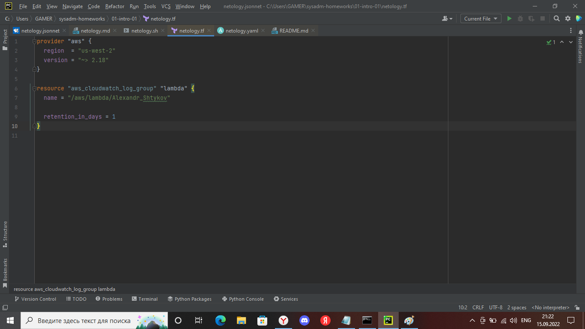
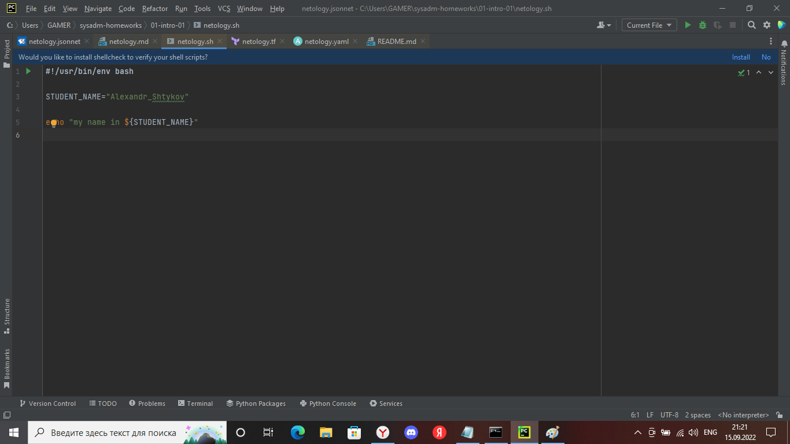
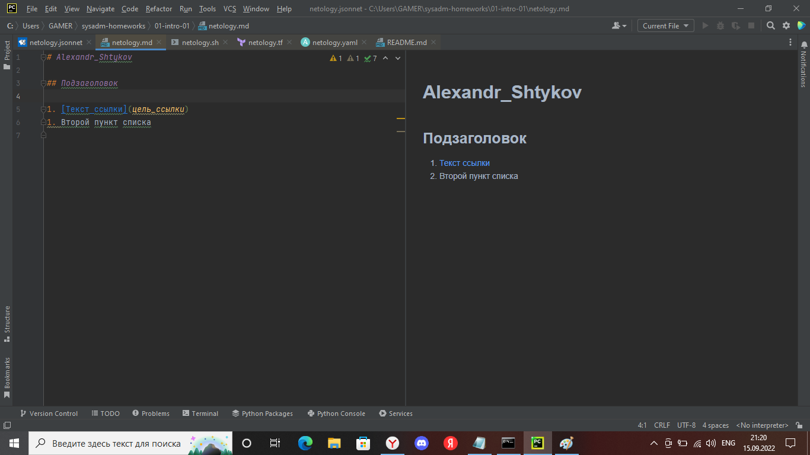
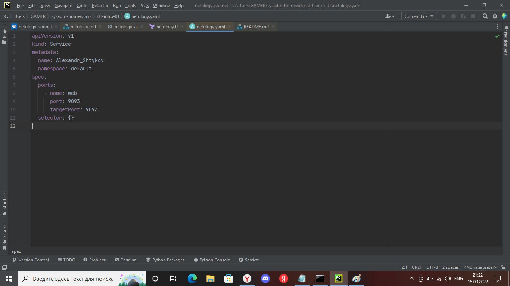
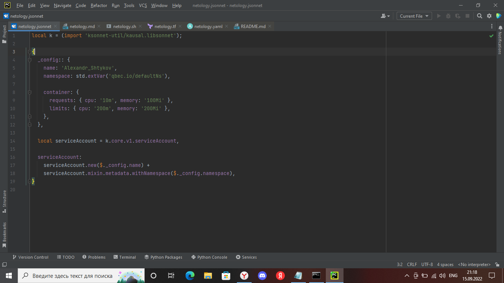

# Домашнее задание к занятию «1.1. Введение в DevOps»

## Задание №1 - Подготовка рабочей среды

1. Работа подсветки синтаксиса:
    - Terraform: 
    - Bash: 
    - Markdown: 
    - Yaml: 
    - Jsonnet: 

## Задание №2 - Описание жизненного цикла задачи (разработки нового функционала)

### Решение

На первом этапе (Анализ требований) формируются цели и задачи проекта, определяются сроки и стоимость разработки нового функционала, формируется техническое задание. Менеджер проекта проводит коммуникации  с клиентом для сбора всей необходимой информация. Как только сбор требований завершен, аналитик проверяет их. В случае выявления неточностей или неоднозначности, назначается повторная встреча с клиентом для обсуждения. Как только требования станут однозначны и ясны, создается Спецификация требований. Данный документ должен быть тщательно изучен и правильно понят всеми участниками проекта.

На втором этапе (Проектирование) на основании этих требований, зафиксированных в Спецификации, создается архитектура проекта (проектная документация), которая будет использоваться в процессе разработки нового функционала.

На третьем этапе (разработка) команда разработки пишет код и модульные тесты к этому коду, проводит инспекцию кода, статический анализ качества кода. DevOps – инженер обеспечивает автоматизацию сборки сохраненного кода и развертывания дистрибутива на среду разработки.

На четвертом этапе (тестирование) происходит выделение тестовых сред, подготавливаются тестовые наборы данных. Осуществляется автоматическое конфигурирование сред и дальнейшее развертывание дистрибутива на тестовые среды (задача DevOps-инженер). Командой тестирования дистрибутив тщательно тестируется (запускается набор тестов, как автоматизированных, так и «ручных»), и все найденные баги передаются команде разработчиков для исправления. Тестировщики сверяют Спецификацию и созданный продукт,  чтобы убедиться, что дистрибутив соответствует ожиданиям заказчика. Поэтому этап тестирования тесно связан с этапом проектирования.

На пятом этапе (Внедрение и сопровождение) в случае успешного прохождения испытаний (приемочное тестирование заказчиком) принимается решение о развертывании дистрибутива на ПРОМ среду. Происходит автоматизированное развертывание дистрибутива на ПРОМ среду (DevOps-инженер). В случае ошибок – выполняется автоматический откат и доработка. После ввода в эксплуатацию осуществляется поддержка продукта. Мониторинг продукта гарантирует быстрый цикл обратной связи (DevOps-инженер получает данные (метрики), которые позволяют более точно спланировать следующий этап разработки)

На каждом из этапов происходит тесное взаимодействие и общение между всеми участниками процесса